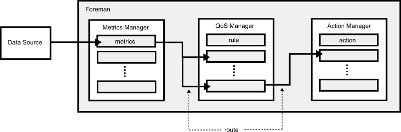

# Action Model

## Execution Model



### Method

Foreman enables to build monitoring actions to define the small methods using any programming languages and connect between the methods like pipeline of Unix.

### Route

Foreman supports dataflow programming as reactive programming to execute a complex DAG (directed acyclic graph). In Foreman, the dataflow function is called as ’route’.


## QoS JSON Format

```
[
  [
    {
      "param " : ...,
      "op" : ...,
      "threshold" : ...,
      "current" : ...,
    },
    {
      ....
    }
  ],
  [
    ....
  ]
]
```

## Supported Programming Languages

Foreman support the following programing languages to write action codes.

- Python
- LUA
- System (Shell Command)


### Action Specificcation

The interface of the action function is specified as the following. 

| Item | Type | Description |
| --- | --- | --- |
| Method Name | - |  |
| Request Result | bool |  |
| Request Paramaters | map<string, object> | |
| Response Paramaters | map<string, object> | |
| Error | error | |

### Parameter Data Types

| Foreman Type | Go | C++  | Python | LUA | Shell |
| --- | --- | --- | --- | --- | --- |
| Integer | Int64 | long | long | - | - |
| Real | float64 | double | float | - | - |
| String | string | string | string | - | - |
| Bool | bool | bool | bool | - | - |

### Python

For Python, the action method specification is bellow.

```
def <method_name>(params, results):
    return ((True || None) or object)
```

#### Arguments

| Name | Direction | Type | Description |
| --- | --- | --- | --- |
| params | IN | Dictionary | Dictionary of input parameters for the action |
| results | OUT | Dictionary | - |

#### Return value

The action method should return `True` or `None` when it is executed normally. 
However, you don't have to return the success objects expressly because all Python functions return the `None` object when these don't use `return`.

The action method should return an error object when it is not executed normally. The action manager translates the error object to a string, set the string as the detail error message.

## Event

### QoS

When the QoS manager detects a Qos which is not satisfied, it sends a following event to the specified action method which is a connected with the QoS by the route. 

| Argument | Direction | Type | Description |
| --- | --- | --- | --- |
| qos | IN | QoS |
| - | OUT | - | - |

Currently, Foreman doesn't handle any responses, and so the action method should not return any parameters.
