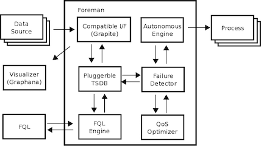

## Architecture

This diagram illustrates the core architecture of Foreman, and the core components are written in C.

### Federated database

A federated database system is a type of database system, which consists of multiple autonomous database systems into a single federated database. Foreman is the primitive database; the operator can define a federated database system which consists of multiple Foreman nodes.

The interface of the time series database is abstracted for the federated database. Through the interface abstraction, the consumer and the provider can access the federated database system with a uniform method.

### Dynamic Interface

trigger
route 
actoion