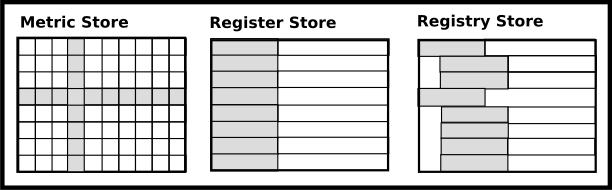

# Data Model

Foreman has two abstracted data models, the registry store and metric store, internally. The registry store is used to store any metadata such as the configuration settings, and the metric store is used to store time-series metrics data such as monitoring data.



## Registry Store

Foreman has an abstracted registry store to store any metadata such as the configuration settings. The store is a hierarchical object store as the following.


The following metadata are stored into the registry store.

- [Programmng Model](programming_model.md)
  - QoS
  - Action
  - Rule
- [Configuration](configuration.md)

### Abstract Interface

The registry store consists of the following three abstract interfaces, `Store`, `Object` and `Property`.

#### Store

The abstracted registry store is defined as the following interface, and it can store multiple objects hierarchically.

```
type Store interface {
	Open() error
	Close() error

	SetObject(obj *Object) error
	GetObject(objID string) (*Object, error)
	DeleteObject(objID string) (*Object, error)

	Browse(q *Query) ([]*Object, error)
	Search(q *Query) ([]*Object, error)
}
```

#### Object

The stored object is defined as the following interface, and it can store any multiple properties like object-oriented database.

```
type Object interface {
	GetID() string
	GetParentID() string
	GetName() string

	SetString(data string) error
	GetString() (string, error)

	GetProperty(name string) (string, error)
	GetAllProperties() ([]Property, error)

	String() string
}
```

The all object has a unique ID, the all object can have multiple child object. To get all child objects in an object, use `Store::Browse()` with the objectID.

The object which has no any properties is defined as `container` object, and the object which has any properties is called as `item` object.

The root object is a special container object. The object ID is '0', and the parent ID is blank.

#### Property

The property has a name and value as the following interface.

```
type Property interface {
	SetName(name string)
	GetName() string

	SetString(value string) error
	GetString() (string, error)

	SetInteger(value int) error
	GetInteger() (int, error)

	SetReal(value float64) error
	GetRealInteger() (float64, error)
}
```

## Metric Store

Foreman has an abstracted metric store to store time-series metrics data such as monitoring data. The store is a simple matrix time-series database as the following.


### Public Interfaces

Foreman offers the following interfaces to store and access the time-series metrics data in the metric store.

- [RPC Protocol](rpc_protocol.md)
  - [Foreman Query Language](dsl.md)
- [Graphite Compatible Interface](graphite.md)


### Abstract Interface

The abstracted metric store is defined as the following interface.

```
type Store interface {
	SetRetentionInterval(value time.Duration) error
	GetRetentionInterval() (time.Duration, error)

	Open() error
	Close() error

	AddMetric(m *Metric) error
	Query(q *Query) (ResultSet, error)

	String() string
}
```
