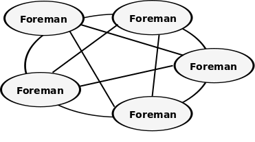

# Discovery Methods

Each node belongs to a cluster, and it is running independently in the cluster.
Each node can discover other nodes in the same cluster and can associate as a federated database and collaborate with other nodes too.
This section describes the network topology and the configuration to set the cluster.

## Topology

Foreman adopts a fully connected network topology as the following figure, and so each node knows all other nodes which are running in the same cluster.

Each node has the same cluster name of the cluster, and it can send any request messages using [the RPC Protocol](rpc_protocol.md) to the other nodes.

## Finder

The finder is a core function which discovers other nodes to construct the abstract cluster network on the physical network environment. Currently, Foreman supports the following finders as default.

### Zeroconf Finder

The Zeroconf finder is a default finder to find other nodes automatically without any configuration based on [ECHONET Lite][enet]. [ECHONET][enet] is an open standard specification for IoT devices in Japan, it specifies more than 100 IoT devices such as crime prevention sensor, air conditioner and refrigerator.

The finder can find other nodes which belong to the same cluster using the Zeronconf protocol in the local network. 

NOTE: The protocol can discover any nodes in the local network, but it can't find any node over the local network generally because it uses the multicast messages to discover other nodes. To find over the local network, you might have to change the network configuration such as the network switches and routers.

[enet]:http://echonet.jp/english/

### Static Finder

The static finder defines a static cluster which can't be modified ....

NOTE : Foreman support the finder as [StaticFinder](https://github.com/cybergarage/foreman-go/blob/master/foreman/discovery/finder_static.go) with the unit test, but the interfaces such as the configuration file which defines the static nodes are not implemented yet. 

### Shared Finder

The shared finder defines a dynamic cluster which can be added or removed any nodes manually ....

NOTE : In additiation to the above static finder, Foreman support the finder as [SharedFinder](https://github.com/cybergarage/foreman-go/blob/master/foreman/discovery/finder_shared.go) with the unit test, but the interfaces  are not implemented yet. 

### Directory Finder

The finder defines a finder using general directory services such as [etcd](https://coreos.com/etcd/), [Consul](https://www.consul.io) and [Zookeeper](https://zookeeper.apache.org) .....

NOTE : Foreman will support the function in the feature, but it is not implemented yet.

