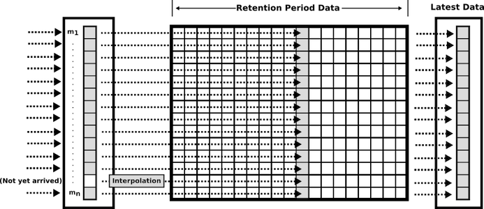

# Pragramming Model

The programming model of Foreman is based on [event-driven programming](https://en.wikipedia.org/wiki/Event-driven_programming) like [publish–subscribe pattern](https://en.wikipedia.org/wiki/Publish–subscribe_pattern) to set the failure detection and autonomous recovery functions dynamically. 

The programming model is consist of Foreman's metrics, rules, actions and routes as the following figure.


## Metrics Manager

The metrics manager has a pluggable time-series database to store metrics which are pushed from other data sources.



The QoS manager is a subscriber of the metrics manager. The metrics manager publishes the latest metrics data to the QoS manager when the metrics are updated.

## QoS Manager

The operators can specifiy any minotoring rules to the QoS manager.

```math
\left( \sum_{k=1}^n a_k b_k \right)^{!!2} \leq
\left( \sum_{k=1}^n a_k^2 \right) \left( \sum_{k=1}^n b_k^2 \right)
```

## Action Manager

## Route
