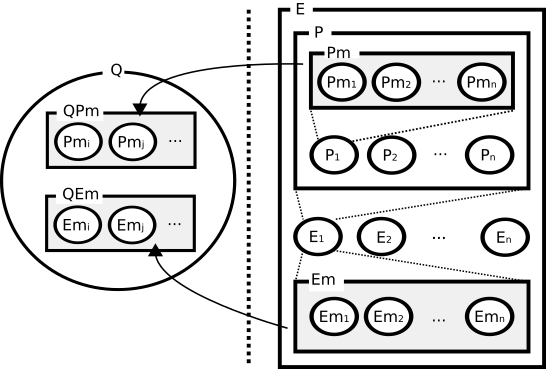

# Programming Model

The programming model of Foreman be affected by reactive and dataflow programming  paradigms. The programming model is based on [event-driven programming](https://en.wikipedia.org/wiki/Event-driven_programming) like [publish–subscribe pattern](https://en.wikipedia.org/wiki/Publish–subscribe_pattern) to set the failure detection and autonomous recovery functions dynamically.

The programming model is consist of the metrics manager, the QoS manager and the action manager as the following figure.


## Action Manager

The action manager executes the specified method which are connected with the specified QoSs by the routes. The operator can define the action methods using some dynamic programming languages such as Python and LUA.

### Dataflow Programming

Foreman supports dataflow programming as the reactive programming to define and execute the complex monitoring rules. In Foreman, the dataflow function is called as `route`. Using the route function, the operator can connect the any actions like pipeline of Unix as the following


### Trigger

The Foreman sends an event which is called as `trigger` which the local status is changed. The operator can connect the trigger with any actions using the route.


Currently, Foreman supports two trigger types, a QoS and an execute trigger. 

#### QoS Trigger

The QoS manager generates the trigger event when the specified QoS formula in the QoS manager is unsatisfied. 

#### Execute Trigger

The action manager generates the trigger event when the action is executed directly using [FQL](dsl.md).

### Programming Languages 

Foreman defines the abstract interface, and so the operator can write the action using dynamic programming languages. Foreman support the the following dynamic programming languages. See [Action](action.md) to know the specification in more detail.


## QoS Manager

The QoS manager is a subscriber of the metrics manager. The metrics manager publishes the latest metrics data to the QoS manager when the metrics are updated.

Foreman consider a distributed system consisting of a finite set of n environments `E = {E1,E2,...,En}` and a finite set of n processes `P = {P1, P2, ..., Pn}` which runs on the environments.



The operators can specifiy any monitoring rules to the QoS manager based on ANF, Algebraic Normal Form, as the following.

```
((Pm1 > 1.0 ∨ P m2 = 5) ∧ (Pm3 > 2.0 ∨ Pm4 <= 1))
```

Please see [QoS Model](qos_model.md) to know the specification in more detail.


## Metrics Manager

The metrics manager has a pluggable [time-series database](https://en.wikipedia.org/wiki/Time_series_database) to store metrics which are pushed from other data sources.


In addition to the metrics manager, the Foreman has some databases internally. See [Data Model](data_model.md) to know the internal databases in more detail.
