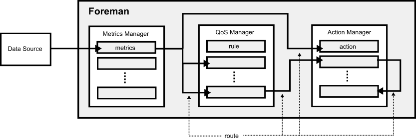

# Pragramming Model

The programming model of Foreman is based on [event-driven programming](https://en.wikipedia.org/wiki/Event-driven_programming) like [publish–subscribe pattern](https://en.wikipedia.org/wiki/Publish–subscribe_pattern) to set the failure detection and autonomous recovery functions dynamically. 

The programming model is consist of Foreman's metrics, rules, actions and routes as the following figure.



## Metrics Manager

The metrics manager has a pluggable [time-series database](https://en.wikipedia.org/wiki/Time_series_database) to store metrics which are pushed from other data sources.


The Foreman's database is also an [active database](https://en.wikipedia.org/wiki/Active_database), it send the latest metrics data to the subscribers when the metrics are updated.

## QoS Manager

The QoS manager is a subscriber of the metrics manager. The metrics manager publishes the latest metrics data to the QoS manager when the metrics are updated.

Foreman consider a distributed system consisting of a finite set of n environments `E = {E1,E2,...,En}` and a finite set of n processes `P = {P1, P2, ..., Pn}` which runs on the environments.


The operators can specifiy any monitoring rules to the QoS manager based on ANF, Algebraic Normal Form, as the following.

```
((Pm1 > 1.0 ∨ P m2 = 5) ∧ (Pm3 > 2.0 ∨ Pm4 <= 1))
```

Please see [System Model](system_model.md) to know about the system model for the QoS manager.

## Action Manager

TBD

## Route

TBD
