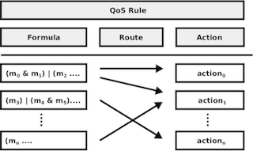

# QoS Model

The knowledge representation for QoS is a human-readable format for autonomous knowledge management. This study manages knowledge based on the rule-based system to separate the static and dynamic rules and actions, and the rules are represented as a common condition format based on Boolean logic. 

## QoS Representation

The QoS knowledge is consist of a QoS formula and the recovery actions. The recovery action is executed when the condition is satisfied. 
The following figure shows the relationship between the conditions and the actions.



All conditions and actions have their unique names, and the observers can set the behavior of the rule to connect the rule with the actions using the names. This study calls the connection between the rule and the action as a route. The observer can set multiple actions to a rule using multiple routes. 

## QoS Formula

`Q` is defined the combination of process metrics in m which are related to QoS directly, and the each literal can be specified a condition that is true. The combination is represented as an ANF, Algebraic Normal Form.
For example, a QoS is defined as the following:

```
((m1 > 1.0) | ((m2 = 5)) & ((m3 > 2.0) | (m4 <= 1))
```

Then the first specified ANF is modified and optimized using the other concerned process and environment metrics with the specified strategy automatically and dynamically.

### QoS EBNF

Currently, QoS should be specified by CNF (Conjunctive normal form) as the following EBNF.

```
qos :=　"(" clause ("&" clause)* ")"
clause := quality ("|" quality)*
quality := "(" operand operator operand ")"
operetor := "==" | "!=" | ">" | "<" | ">=" |  "<="
operand := var | value
var := [a-z_-.]*
value := <floating_point>
```

## QoS Action 

Foreman defines the abstract interface, and so the operator can write the action using dynamic programming languages. Foreman support the the following dynamic programming languages.

- Python
- LUA
- System (Shell Command)

See [Action](action.md) to know the specification in more detail.
