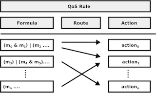

# Introduction

## Foreman Query Language (FQL)

Foremanは、操作言語として[Foreman Query Language (FQL)](../dsl.md)と呼ばれるSQLライクな独自言語をサポートしています。仕様の詳細については、[こちらの資料](../dsl.md)を参照して下さい。

## FQLクライアント - fql

[`foreman-py`](https://github.com/cybergarage/foreman-py)はPython用のForemanクライアントパッケージで、コマンドラインツールとしてRDBMSのクライアントツールのようなインタラクティブな[`fql`](./doc/fql.md)が含まれています。この利用ツールのについては、以下の資料を参照して下さい。

- [`foreman-py`](https://github.com/cybergarage/foreman-py)

また、[Foreman Query Language (FQL)](../dsl.md)は、REST-API経由での要求も可能です。その仕様については、[こちらの資料](../rpc_protocol.md)を参照して下さい。`fql`は、このREST-API経由でFQLを要求するフロントエンドツールです。

### Foremanによる監視

Foremanは、監視をQoSルール、アクション、ルートの３要素で管理します。QoSルールは監視の論理式、アクションはルールが満たされない時に実行されるプログラム、ルートはルールはアクションを紐づけるものです。

詳細については、以下の資料を参照して下さい。

- [QoS Model](qos_model.md)
- [Action Model](action_model.md)
