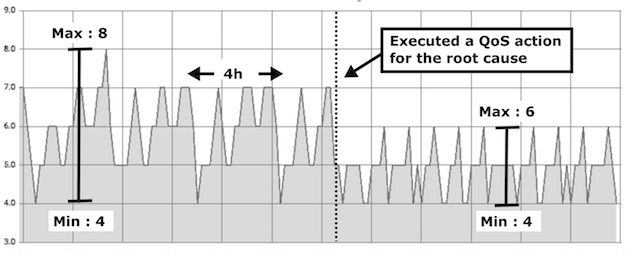

# Foreman with Apache Cassandra

## はじめに

まず最初に、Foremanの基本的な操作については、[こちらのチュートリアル](tutorial_001.md)を参照して下さい。

## 初期設定

最初にApache CassandraのメトリクスをForemanにフィードする設定をします。ForemanはGraphite互換のAPIにも対応しているため、Apache Cassandraの「[Metric Reporters](http://cassandra.apache.org/doc/latest/operating/metrics.html?highlight=metrics#metric-reporters)」を利用してフィードを設定できます。

ローカル環境で試して見る場合には、[CCM (Cassandra Cluster Manager)](https://github.com/riptano/ccm)を用いた[こちらの資料](tutorial_cassandra_000.md)を参考に設定して下さい。

## 例1 : Tombstoneの監視

最初の例としては、Apache Cassandraのアンチパターンであるデータ削除についての監視設定例を示します。Apache CassandraはLog-Structureなストレージエンジンのため、その論理削除によりTombstoneと呼ばれる不要な論理削除データがおよびファイルが蓄積されます。

削除や更新が頻繁に発生するアプリケーションの場合、SSTableファイル数の統計値を監視することにより、間接的にTombstoneの増加を監視が可能です。以下の設定例は、この統計値が閾値を超えた場合に、強制的にその不要な論理削除データを削除し、読み込み遅延を保証するものです。

```
SET ("sstables_compaction","system","nodetool compact","none") INTO ACTION
SET (qos_sstables, "localhost.org.apache.cassandra.metrics.Table.SSTablesPerReadHistogram.all.p999 < 5") INTO QOS
SET (qos_route, qos_sstables, sstables_compaction) INTO ROUTE
```

以下に、この監視ルールを設定した際の、SSTableファイル数統計値の数意を示します。ルール設定前は統計値が8を超え読み込み遅延が発生していましたが、このルールの設定による適切な閾値で、読み込み遅延を保証されています。


